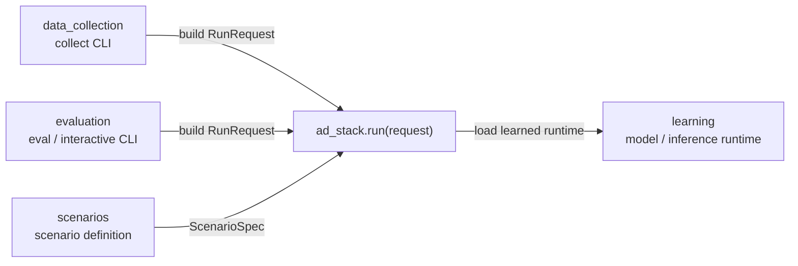

# AD Stack Single Entrypoint Plan

このドキュメントは、`data_collection` と `evaluation` を
「同じ simulation runner を違う条件で回すだけ」と見なしたときに、
最終的にどこをどう変えるかを整理するためのものです。

現状では、この方針は main の実装に反映済みです。いま読むときは
「現在の public API をこういう意図で作ったか」の背景メモとして扱ってください。

## 1. 目標

外側の entrypoint は、最終的にこれだけにする。

```python
from ad_stack import run, RunRequest

result = run(request)
```

`data_collection` と `evaluation` は、
`RunRequest` を組み立てて `ad_stack.run(...)` を呼ぶだけにする。

## 2. いまの問題

現状はかなり整理できているが、まだ `run(request)` にはなっていない。

- `data_collection`
  - `create_expert_collector_stack(...)`
  - `stack.run_step(...)`
- `evaluation`
  - `create_pilotnet_eval_stack(...)`
  - `stack.describe()`
  - `stack.run_step(...)`
- `interactive`
  - `create_interactive_pilotnet_controller(...)`
  - `controller.run_step(...)`

つまり、

- `ad_stack` の entrypoint が 1 個ではない
- `evaluation` / `data_collection` 側が simulation loop をまだ持っている
- `collect` と `evaluate` が「mode 違い」ではなく「別実装」に見える

## 3. 理想の依存



この図でのノードの意味:

- `data_collection`, `evaluation`
  - CLI / wrapper directory
- `scenarios`
  - route, weather, spawn, stop criteria の定義置き場
- `ad_stack`
  - simulation 実行本体
- `learning`
  - learned runtime の供給元

## 4. 目標 API

### 4.1 `RunRequest`

`RunRequest` は最低限これを持つ。

- `mode`
  - `collect`
  - `evaluate`
  - `interactive`
- `scenario`
  - route
  - town
  - spawn
  - weather
  - stop criteria
- `policy`
  - `expert`
  - `learned`
  - `interactive`
- `model`
  - checkpoint path
  - device
  - learned policy 設定
- `runtime`
  - fixed delta
  - vehicle filter
  - camera size / fov
  - sensor timeout
- `artifacts`
  - manifest を出すか
  - video を出すか
  - output dir
  - collect/evaluate ごとの保存設定

イメージ:

```python
@dataclass(slots=True)
class RunRequest:
    mode: Literal["collect", "evaluate", "interactive"]
    scenario: ScenarioSpec
    policy: PolicySpec
    model: ModelSpec | None
    runtime: RuntimeSpec
    artifacts: ArtifactSpec
```

### 4.2 `RunResult`

`RunResult` は外側が必要な結果だけ返す。

- `summary`
- `success`
- `manifest_path`
- `video_path`
- `frame_count`
- `elapsed_seconds`

イメージ:

```python
@dataclass(slots=True)
class RunResult:
    success: bool
    summary: dict[str, Any]
    manifest_path: Path | None
    video_path: Path | None
    frame_count: int
    elapsed_seconds: float
```

## 5. 何をどう変えるか

### 5.1 `ad_stack` に寄せるもの

`ad_stack` が simulation 実行本体になる。

`ad_stack` に持たせるもの:

- `run(request) -> RunResult`
- CARLA world setup / teardown
- actor spawn / destroy
- sensor attach / image queue
- fixed-delta simulation loop
- policy の選択
  - expert
  - learned
  - interactive
- learned runtime load
- progress / success 判定
- frame event 集計
- manifest / summary / video の生成

つまり、いま `collect_route_loop.py` と
`evaluate_pilotnet_loop.py` が持っている本体を `ad_stack` に移す。

### 5.2 `data_collection` から削るもの

`data_collection` は CLI wrapper にする。

残すもの:

- collect 用 CLI 引数
- `RunRequest(mode="collect", ...)` の組み立て
- `ad_stack.run(request)` 呼び出し

削るもの:

- CARLA world setup
- actor / sensor 管理
- simulation loop
- summary / manifest / video 生成本体

### 5.3 `evaluation` から削るもの

`evaluation` も CLI wrapper にする。

残すもの:

- eval 用 CLI 引数
- `RunRequest(mode="evaluate", ...)` の組み立て
- `ad_stack.run(request)` 呼び出し

interactive も同様に:

- `RunRequest(mode="interactive", ...)`
- `ad_stack.run(request)`

削るもの:

- CARLA world setup
- actor / sensor 管理
- simulation loop
- progress / stop 判定
- manifest / summary / video 生成本体

### 5.4 `scenarios` を入口にする

`route-config` だけではなく、simulation 実行条件を `ScenarioSpec` にまとめる。

最低限まとめたいもの:

- town
- route
- weather
- spawn transform / spawn index
- target speed
- goal tolerance
- max seconds
- max stop seconds

collect と evaluate の違いは、
`ScenarioSpec` ではなく `mode` と `policy` に閉じるのが理想。

### 5.5 `learning` の責務

`learning` は引き続き learned runtime の供給元に留める。

残すもの:

- model definition
- checkpoint load
- preprocess
- inference runtime

持たせないもの:

- CARLA loop
- simulation orchestration
- manifest / summary 生成

## 6. 実装順

### Step 1

`ad_stack/run.py` を作る。

ここに:

- `RunRequest`
- `RunResult`
- `run(request)`

を置く。

### Step 2

いま `collect_route_loop.py` と `evaluate_pilotnet_loop.py` にある
共通 simulation loop を `ad_stack.run(...)` に移す。

最初は mode 分岐でよい。

- `mode="collect"`
- `mode="evaluate"`
- `mode="interactive"`

### Step 3

artifact 出力を `ad_stack` 側に寄せる。

- manifest
- summary
- video

collect/evaluate の差は `ArtifactSpec` で吸収する。

### Step 4

`data_collection` / `evaluation` を thin wrapper 化する。

各 CLI は最終的に:

1. args parse
2. `RunRequest` build
3. `ad_stack.run(request)`
4. result print

だけにする。

### Step 5

`create_expert_collector_stack(...)`,
`create_pilotnet_eval_stack(...)`,
`create_interactive_pilotnet_controller(...)`
を非推奨にするか、`run(request)` の内部 helper に落とす。

## 7. 完了条件

これができたら完了とみなす。

- `data_collection` は `ad_stack.run(request)` しか呼ばない
- `evaluation` は `ad_stack.run(request)` しか呼ばない
- collect / evaluate / interactive は `mode` の違いとして表現される
- summary / manifest / video 生成本体は `ad_stack` にある
- `learning` は runtime 供給だけを担当する

## 8. この変更で得たいこと

- 依存が単純になる
- `data_collection` と `evaluation` の重複が減る
- simulation 条件の差分が `RunRequest` に集約される
- 将来 mode が増えても CLI wrapper を増やすだけで済む
- architecture の説明が簡単になる

最終的に説明はこれで足りる状態を目指す。

```text
data_collection / evaluation は request を作る
ad_stack.run(request) が simulation を実行する
learning は learned runtime を供給する
```
