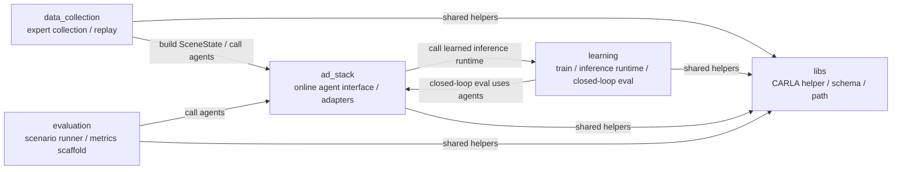

# Directory Relationships

このドキュメントは、project root 直下のうち主にソースコードを持つディレクトリが、いまどう依存しているかをまとめたものです。

重要:

- ここでは `docs/`, `data/`, `outputs/` のような非ソースコード中心のディレクトリは図から省いています
- `scenarios/` はまだ現行の主要実行フローには組み込んでいないので、図から外しています

## 1. 現在の実装依存

現状のポイント:

- `data_collection/` の fixed-route expert 収集は `ad_stack.agents.ExpertBasicAgent` を使う
- `learning/` の closed-loop 評価は `ad_stack.agents.LearnedLateralAgent` を使う
- `ad_stack/` は learned lateral policy の推論時に `learning/` の inference runtime を呼ぶ
- `learning/` は offline train code と inference runtime を持つが、online な command 生成自体は `ad_stack/` 側で行う
- `evaluation/` は generic な scenario runner の置き場だが、現状の main flow は主に `learning/pipelines/evaluate/` にある

## 2. 現在の責務分担

- `data_collection/`
  - `CARLA` world を進める
  - sensor と ego 状態から `SceneState` を組み立てる
  - `ad_stack` の expert agent を呼ぶ
  - `EpisodeRecord` と画像を保存する
- `learning/`
  - dataset, model, train code を持つ
  - checkpoint load / preprocess / infer の runtime を持つ
  - learned policy の closed-loop 評価入口を持つ
- `ad_stack/`
  - `SceneState -> ControlDecision` の interface を提供する
  - `BasicAgent` adapter と learned lateral agent adapter を持つ
  - 必要に応じて `learning/` の inference runtime を呼ぶ
- `evaluation/`
  - scenario runner, metrics, report の共通化用
- `libs/`
  - route config, `CARLA` PythonAPI 接続補助, project root 解決, schema を持つ

## 3. ディレクトリ間インターフェース

### `data_collection/` -> `ad_stack/`

- 入力:
  - `ad_stack.world_model.scene_state.SceneState`
- 出力:
  - `ad_stack.agents.base.ControlDecision`
  - その中の `VehicleCommand`

実際の流れ:

- `data_collection/` が `ObservationBuilder` で `SceneState` を作る
- `ExpertBasicAgent.step(scene_state)` を呼ぶ
- 返ってきた `VehicleCommand` を `carla.VehicleControl` に変換して適用する

### `learning/` -> `ad_stack/`

- `learning/pipelines/evaluate/` の closed-loop evaluator が `SceneState` を作る
- `LearnedLateralAgent.step(scene_state)` を呼ぶ
- longitudinal は `ExpertBasicAgent`、lateral は learned policy で合成する

### `ad_stack/` -> `learning/`

- `ad_stack` は `learning.libs.ml.PilotNetInferenceRuntime` を呼ぶ
- 現在の入力は `SceneState.metadata` 経由で渡している
  - `front_rgb_history`
  - `command`
  - `route_point`

これは現在動いている interface だが、まだ暫定的です。将来的に厳密化するなら、`SceneState.metadata` ではなく typed な learned-observation 構造に切り出したほうがよいです。

## 4. 主要な公開面

### `ad_stack` が提供するもの

- `ad_stack.agents.base.AutonomyAgent`
  - `step(scene_state) -> ControlDecision`
- `ad_stack.agents.base.VehicleCommand`
  - `steer`, `throttle`, `brake`
- `ad_stack.world_model.scene_state.SceneState`
  - ego / route / traffic light / tracked object の統合状態
- `ad_stack.agents.ExpertBasicAgent`
  - `CARLA BasicAgent` の adapter
- `ad_stack.agents.LearnedLateralAgent`
  - learned steer policy を online loop に載せる agent

### `learning` が提供するもの

- model 定義
- checkpoint load / preprocess / infer の runtime
- `learning.libs.ml.PilotNetInferenceRuntime`

### `libs` が提供するもの

- route config / planned route
- `CARLA` PythonAPI への接続補助
- project root 解決
- JSONL schema
