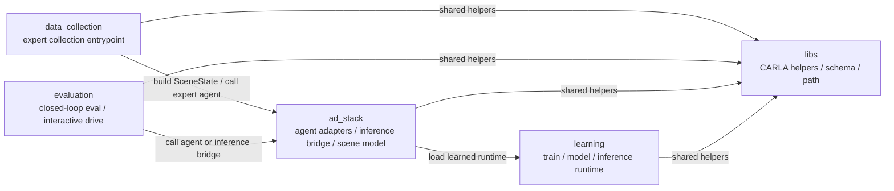
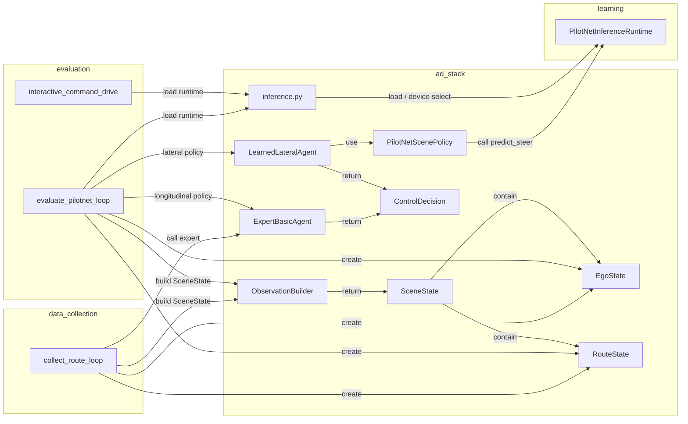

# Directory Relationships

このドキュメントは、現行実装の関係を 2 段で見せるためのものです。

- 1 枚目:
  - directory ごとの責務と大まかな依存
- 2 枚目:
  - 実際に使っている module / class の依存

重要:

- ここでは `docs/`, `data/`, `outputs/` のような非ソースコード中心のディレクトリは図から省いています
- `libs/` は多くの場所から参照されるので、directory 図には入れますが module 図では本文補足に留めます

## 1. Directory Responsibility

この図の読み方:

- `data_collection/` は expert 収集の入口
- `evaluation/` は closed-loop evaluator と interactive drive の入口
- `ad_stack/` は online 実行側の境界
- `learning/` は学習と learned runtime を持つ
- 依存の主軸は `data_collection/evaluation -> ad_stack -> learning`

## 2. Module / Class Dependency

この図の読み方:

- `collect_route_loop` は `ObservationBuilder` と `ExpertBasicAgent` を使う
- `evaluate_pilotnet_loop` は `ExpertBasicAgent` と `LearnedLateralAgent` を組み合わせる
- `interactive_command_drive` は agent interface ではなく `ad_stack.inference` を使う
- `evaluation` から `learning` への direct import は持たせず、`ad_stack` を境界にしている

## 3. Interface Boundary

### `data_collection` / `evaluation` -> `ad_stack`

- 入力:
  - `SceneState`
- 出力:
  - `ControlDecision`
  - `VehicleCommand`

### `ad_stack` -> `learning`

- `PilotNetInferenceRuntime`
- `load_pilotnet_runtime`
- `select_device`

現在の learned-policy 入力はまだ `SceneState.metadata` 経由です。

- `front_rgb_history`
- `command`
- `route_point`

これは動作上は十分ですが、将来的に厳密化するなら typed な learned-observation 構造へ切り出すのが自然です。

## 4. `libs` の位置づけ

図では省いている細かい共通依存は `libs/` にあります。

- `libs.carla_utils`
  - route config, planned route, CARLA helper
- `libs.schemas`
  - `EpisodeRecord`
- `libs.project`
  - project root 解決と evaluation 用 run id helper
