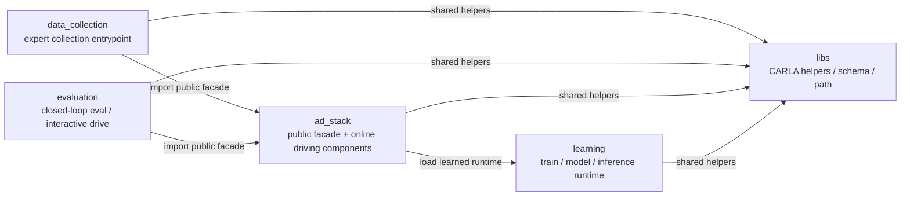
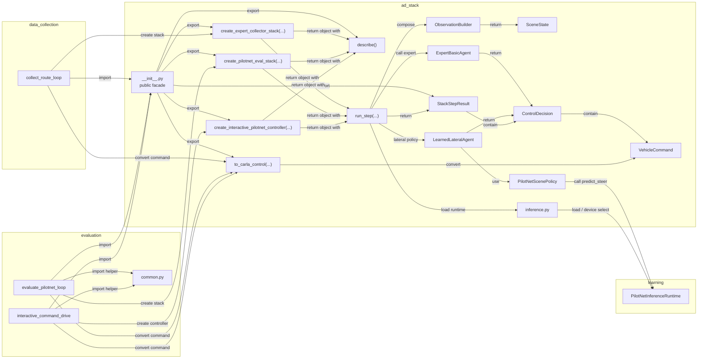

# Directory Relationships

このドキュメントは、現行実装の関係を 2 段で見せるためのものです。

- 1 枚目:
  - directory ごとの責務と公開依存
- 2 枚目:
  - 実際に使っている module / public API の依存

前提:

- `docs/`, `data/`, `outputs/` のような非ソースコード中心のディレクトリは図から省いています
- `libs/` は多くの場所から参照されるので、directory 図にだけ出し、module 図では本文補足に留めます
- 外側の runner は `ad_stack` の内部モジュールを直接 import しません

## 1. Directory Responsibility

この図の読み方:

- `data_collection/` は expert 収集の入口
- `evaluation/` は closed-loop evaluator と interactive drive の入口
- `ad_stack/` は外部に公開する依存面と online 実行部品をまとめて持つ
- `learning/` は学習コードと learned runtime を持つ
- 依存の主軸は `data_collection/evaluation -> ad_stack -> learning`

## 2. Module / Public API Dependency

この図の読み方:

- 外側の runner は `ad_stack.__init__` だけを import する
- `collect_route_loop` は `create_expert_collector_stack(...)` が返す stack を呼ぶ
- `evaluate_pilotnet_loop` は `create_pilotnet_eval_stack(...)` が返す stack を呼ぶ
- `interactive_command_drive` は `create_interactive_pilotnet_controller(...)` が返す controller を呼ぶ
- 外側は返ってきた object に対して `run_step()` を呼び、必要なら `describe()` で静的情報を読む
- 外側は `StackStepResult` から `ControlDecision` を取り出し、必要なら `to_carla_control(...)` で `carla.VehicleControl` に変換する
- `SceneState` と `ObservationBuilder` は `ad_stack` の内部に閉じる
- `evaluation` / `data_collection` から `learning` への direct import は持たせない

## 3. Public Dependency Surface

外側の directory が見てよい `ad_stack` の公開面は [ad_stack/__init__.py](/home/masa/carla_alpamayo/ad_stack/__init__.py) です。

主に公開しているもの:

- `create_expert_collector_stack`
- `create_pilotnet_eval_stack`
- `create_interactive_pilotnet_controller`
- `to_carla_control`
- `StackDescription`
- `StackStepResult`
- `ControlDecision`
- `VehicleCommand`

実務上、外側の runner が直接使うのは主に factory 関数群、戻り値 object の `run_step()` / `describe()`、`to_carla_control` です。
現状の利用としては `describe()` を主に使っているのは `evaluate_pilotnet_loop` です。

`data_collection/` と `evaluation/` は、`ad_stack.runtime.*`, `ad_stack.agents.*`, `ad_stack.world_model.*`, `ad_stack.inference` のような内部パスを直接 import しません。

## 4. Agent / Inference Boundary

### `data_collection` / `evaluation` -> `ad_stack`

外側が受け取るのは high-level stack / controller とその step 結果です。

- 出力:
  - `StackDescription`
  - `StackStepResult`
  - `ControlDecision`
  - その中の `VehicleCommand`

### `ad_stack` -> `learning`

learned runtime を使う経路では、境界は次です。

- `PilotNetInferenceRuntime`
- `load_pilotnet_runtime`
- `select_device`

`SceneState` は外側の directory の interface ではなく、`ad_stack` 内部表現です。
現在の learned-policy 入力はまだ `SceneState.metadata` 経由です。

- `front_rgb_history`
- `command`
- `route_point`

これは動作上は十分ですが、将来的に厳密化するなら typed な learned-observation 構造へ切り出すのが自然です。

## 5. `libs` の位置づけ

図では省いている細かい共通依存は `libs/` にあります。

- `libs.carla_utils`
  - route config, planned route, CARLA helper
- `libs.schemas`
  - `EpisodeRecord`
- `libs.project`
  - project root 解決と evaluation 用 run id helper
