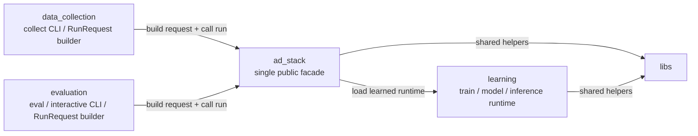
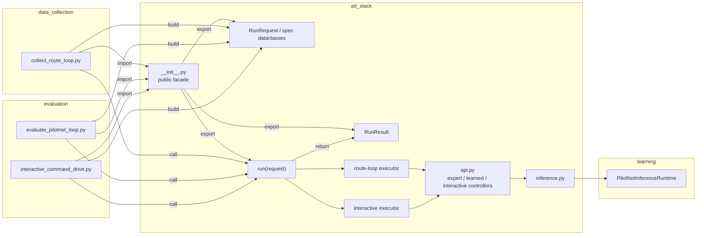

# Directory Relationships

このドキュメントは、現行実装の関係を 2 段で見せるためのものです。

- 1 枚目:
  - directory ごとの責務と公開依存
- 2 枚目:
  - 実際に使っている module / public API の依存

前提:

- `docs/`, `data/`, `outputs/` のような非ソースコード中心のディレクトリは図から省いています
- `libs/` は多くの場所から参照されるので、directory 図にだけ出し、module 図では本文補足に留めます
- `data_collection/` と `evaluation/` は `ad_stack` の内部 module を直接 import しません

## 1. Directory Responsibility

この図の読み方:

- `data_collection/` は collect 用 CLI と request 組み立てを持つ
- `evaluation/` は closed-loop eval / interactive drive の CLI と request 組み立てを持つ
- 実行本体は `ad_stack.run(request)` に集約している
- `learning/` は learned runtime を供給する
- directory 間の主な依存は `data_collection/evaluation -> ad_stack -> learning`

## 2. Module / Public API Dependency

この図の読み方:

- 外側の runner は `ad_stack.__init__` だけを import する
- 外側が組み立てるのは `RunRequest` だけで、実行は `run(request)` に集約する
- collect と evaluate の違いは request の `mode / policy / scenario / artifacts` の違いとして表現する
- `api.py` の stack/controller 群は `ad_stack` 内部実装であり、外側には公開しない
- `learning` への依存は `ad_stack.inference` 経由に閉じている

## 3. Public Dependency Surface

外側の directory が見てよい `ad_stack` の公開面は [ad_stack/__init__.py](/home/masa/carla_alpamayo/ad_stack/__init__.py) です。

公開しているもの:

- `RunRequest`
- `RunResult`
- `RouteLoopScenarioSpec`
- `InteractiveScenarioSpec`
- `RuntimeSpec`
- `PolicySpec`
- `ArtifactSpec`
- `run`

`data_collection/` と `evaluation/` は、`ad_stack.api`, `ad_stack.runtime.*`, `ad_stack.agents.*`, `ad_stack.world_model.*`, `ad_stack.inference` を直接 import しません。

## 4. Single Entrypoint Boundary

外側が `ad_stack` に渡す interface は `RunRequest` だけです。

- collect:
  - `RunRequest(mode="collect", ...)`
- evaluate:
  - `RunRequest(mode="evaluate", ...)`
- interactive:
  - `RunRequest(mode="interactive", ...)`

外側が `ad_stack` から受け取る interface は `RunResult` だけです。

- `success`
- `summary`
- `episode_id`
- `output_dir`
- `summary_path`
- `manifest_path`
- `video_path`
- `frame_count`
- `elapsed_seconds`

## 5. `libs` の位置づけ

図では省いている細かい共通依存は `libs/` にあります。

- `libs.carla_utils`
  - route config, planned route, CARLA helper
- `libs.schemas`
  - `EpisodeRecord`
- `libs.project`
  - project root 解決と evaluation 用 clean-git helper
