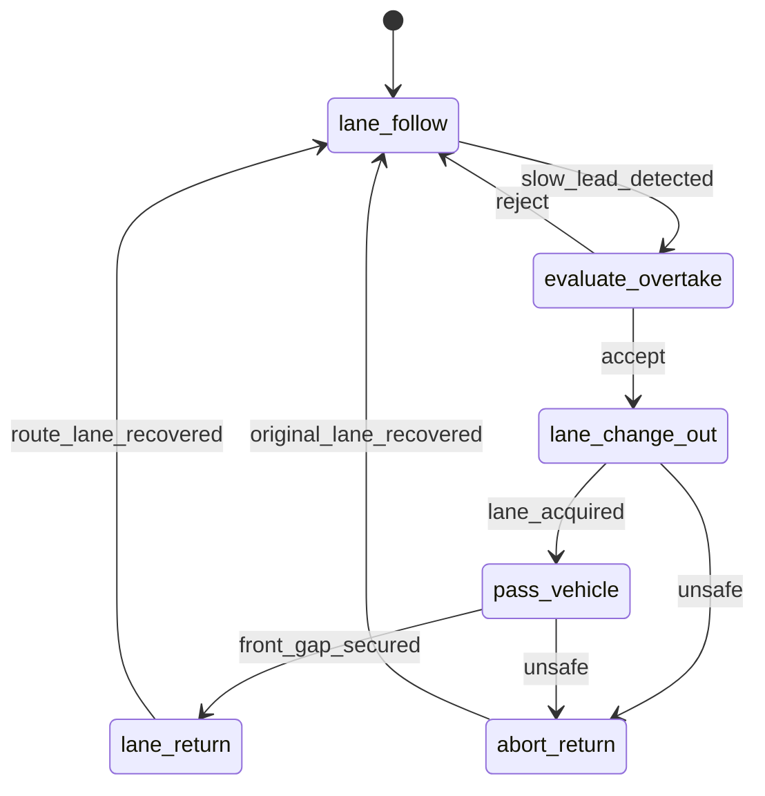

# Expert Policy Design

このドキュメントは [EXPERT_POLICY_REQUIREMENTS.md](./EXPERT_POLICY_REQUIREMENTS.md) を、
現在の `simulation -> ad_stack.run(request)` 構成に接続する具体設計へ落としたものです。

対象は、`CARLA` の privileged state を直接参照する expert policy です。
学習モデルではなく、収集と benchmark 評価の基準として動かすことを前提にします。

## 1. 設計ゴール

この設計で達成したいことは次です。

- `ad_stack.run(request)` の public surface を増やさずに expert 機能を拡張する
- `simulation/` は引き続き request builder のままに保つ
- 信号遵守、追従、追い越しを 1 つの expert policy に統合する
- collect と evaluate の差は request / scenario / artifact の違いだけに保つ

## 2. 設計方針

### 2.1 Public API は変えすぎない

外側は今のまま:

```python
from ad_stack import RunRequest, run

result = run(request)
```

とし、public dataclass を過度に増やさない。

`PolicySpec(kind="expert")` は維持するが、
expert 専用の tuning knob を大量に public field として増やすのは避ける。
細かな閾値や挙動調整値は、原則として次のどちらかで扱う。

- `ad_stack/configs/expert/*.json`
- `ad_stack` 内部の `ExpertPolicyConfig`

### 2.2 低レベル制御は既存資産を最大限再利用する

横制御と基本的な speed control は `CARLA` の既存 controller / PID 系を再利用する。
今回新しく実装する中心は次です。

- scene understanding
- traffic light handling
- lead vehicle following
- overtake decision / state machine
- safety veto

### 2.3 file 分割は増やしすぎない

この repo では過度な細分化を避けたいので、
最初の実装は次の程度に留める。

- `ad_stack/world_model/scene_state.py`
  - typed state を追加
- `ad_stack/api.py`
  - expert stack の orchestration を追加
- `ad_stack/run.py`
  - scenario/NPC setup と summary/logging 反映を追加
- `scenarios/routes/`
  - route 定義
- `scenarios/environments/`
  - traffic light / NPC 初期配置
- `scenarios/npc_profiles/`
  - NPC 速度や挙動 preset

必要なら Phase 2 以降で internal module を分ける。

## 3. 高レベル構成

```mermaid
flowchart LR
  simulation["simulation<br/>RunRequest builder"] -->|run(request)| adstack["ad_stack.run"]

  subgraph ad_stack["ad_stack internal"]
    runner["route-loop executor"]
    builder["scene builder"]
    expert["expert route policy"]
    safety["safety veto"]
    sink["manifest / summary sink"]
  end

  subgraph scenarios["scenarios"]
    route["routes/*.json"]
    traffic["environments/*.json"]
    npc["npc_profiles/*.json"]
  end

  simulation --> scenarios
  route --> runner
  traffic --> runner
  npc --> runner

  runner --> builder
  builder --> expert
  expert --> safety
  safety --> sink
```

この図での意味:

- `simulation/` は mode, route, checkpoint, artifact を決めるだけ
- `ad_stack.run()` が route-loop の world setup, NPC setup, policy loop を全部持つ
- expert policy は `scene -> desired behavior -> target command` を返す
- 最後に safety veto が command を上書きできる

## 4. 既存コードへの反映方針

### 4.1 `run.py`

`ad_stack/run.py` に追加・変更する責務:

- route-loop 実行時に `environment_config` を読み込み、必要なら内部で `npc_profile` を解決する
- NPC spawn と lifecycle 管理
- observer 用 actor collection
- summary に expert 固有指標を集約
- frame manifest へ expert debug 情報を流す

### 4.2 `api.py`

`ad_stack/api.py` に追加・変更する責務:

- `ExpertCollectorStack` を `BasicAgent` wrapper から `ExpertRoutePolicy` ベースに置き換える
- current route progress の更新
- typed な traffic light / vehicle observation の組み立て
- overtake state machine の管理
- output と debug snapshot を `StackStepResult` に格納

### 4.3 `scene_state.py`

`ad_stack/world_model/scene_state.py` に追加するもの:

- `TrafficLightStateView`
- `DynamicVehicleStateView`
- `LaneRelation`

今の `metadata: dict[str, Any]` だけではなく、
expert policy が必要な状態を typed field として持つ。

ただし、ここで持つのは environment observation に限る。
`planner_state` や `overtake_state` のような policy 内部状態は
`SceneState` には入れず、`StackStepResult.debug` として別に出す。

## 5. データモデル

## 5.1 `RouteLoopScenarioSpec` の拡張

現状の `RouteLoopScenarioSpec` に次を追加する。

```python
@dataclass(slots=True)
class RouteLoopScenarioSpec:
    route_config_path: Path
    weather: str = "ClearNoon"
    goal_tolerance_m: float = 10.0
    max_stop_seconds: float = 10.0
    stationary_speed_threshold_mps: float = 0.5
    max_seconds: float = 600.0
    environment_config_path: Path | None = None
```

意味:

- `route_config_path`
  - ego の global route
- `environment_config_path`
  - 信号 override、NPC 初期配置、scenario 固有の traffic 条件
  - 必要なら内部で `npc_profile_id` を参照する

## 5.2 `PolicySpec` の扱い

`PolicySpec.kind="expert"` を維持しつつ、内部実装を強化する。
新しい public enum は増やさない。

expert tuning 用の閾値は、まず `ExpertPolicyConfig` として
`ad_stack` 内部に閉じるのが自然である。
CLI からは `--expert-config` で config file を選び、
`environment_config` には ego 側の tuning を持ち込まない。

初期候補は次:

```python
traffic_light_stop_buffer_m: float = 3.0
follow_headway_seconds: float = 1.8
yellow_stop_margin_seconds: float = 1.0
overtake_speed_delta_kmh: float = 8.0
overtake_min_front_gap_m: float = 20.0
overtake_min_rear_gap_m: float = 15.0
overtake_signal_suppression_distance_m: float = 35.0
```

## 5.3 `SceneState` の拡張

```python
LaneRelation = Literal["same_lane", "left_lane", "right_lane", "unknown"]


@dataclass(slots=True)
class TrafficLightStateView:
    actor_id: int
    state: Literal["red", "yellow", "green", "unknown"]
    distance_m: float
    affects_ego: bool
    stop_line_distance_m: float | None


@dataclass(slots=True)
class DynamicVehicleStateView:
    actor_id: int
    x_m: float
    y_m: float
    yaw_deg: float
    speed_mps: float
    lane_id: str | None
    relation: LaneRelation
    longitudinal_distance_m: float | None
    lateral_distance_m: float | None
    is_ahead: bool
```

`SceneState` は最終的にこう持つ。

```python
traffic_lights: tuple[TrafficLightStateView, ...]
tracked_objects: tuple[DynamicVehicleStateView, ...]
```

policy 内部状態や debug 用情報は別で持つ。

```python
@dataclass(slots=True)
class ExpertDebugSnapshot:
    planner_state: str
    overtake_state: str
    lead_vehicle_id: int | None
    lead_vehicle_distance_m: float | None
    active_traffic_light_state: str | None
```

これは `SceneState` ではなく、`StackStepResult.debug` や
frame manifest 用の metadata source として扱う。

## 6. Internal module 責務

### 6.1 `RouteLoopExecutor`

役割:

- world setup / teardown
- ego actor spawn
- camera / collision / lane invasion sensor attach
- NPC actor spawn
- tick loop
- expert への `run_step` 呼び出し
- artifact 生成

### 6.2 `SceneBuilder`

役割:

- ego state 構築
- route progress 更新
- active traffic light 特定
- nearby vehicle 抽出
- lane relation 付与

この builder は privileged state を使う。

### 6.3 `ExpertRoutePolicy`

役割:

- high-level behavior decision
- target speed の決定
- lane change / overtake の状態管理
- 低レベル controller へ目標を渡す

### 6.4 `SafetyGuard`

役割:

- frontal TTC 監視
- unsafe lane change 拒否
- emergency brake

最終 `VehicleCommand` に対して veto できる。

## 7. expert policy の決定パイプライン

expert の 1 tick の優先順位は次とする。

```text
1. emergency / imminent collision
2. red light / yellow stop
3. overtake abort
4. overtake execution
5. overtake decision
6. lead vehicle following
7. nominal route follow
```

各段階の出力は次。

- `planner_state`
- `target_lane`
- `target_speed_mps`
- `desired_behavior`

最後に low-level controller が

- steer
- throttle
- brake

を計算し、safety guard が上書きする。

## 8. Traffic Light 設計

## 8.1 observation

`CARLA` から取得するもの:

- ego waypoint
- 対応する traffic light actor
- current light state
- stop line / junction までの距離

## 8.2 decision

traffic light の判断は次の 3 分岐。

- `red`
  - stop
- `yellow`
  - `can_stop_safely` なら stop
  - それ以外なら pass
- `green`
  - nominal

`can_stop_safely` は次で近似する。

```text
stopping_distance =
  reaction_margin_m +
  (speed_mps^2 / (2 * preferred_deceleration_mps2))
```

停止線までの距離がこれ以上なら stop を選ぶ。

## 8.3 logging

記録するもの:

- `traffic_light_stop_count`
- `traffic_light_resume_count`
- `traffic_light_violation_count`
- `last_traffic_light_state`

## 9. Lead Vehicle Following 設計

## 9.1 lead vehicle selection

同一 lane 上で

- `is_ahead == True`
- longitudinal distance が最小

の vehicle を lead vehicle とする。

## 9.2 target speed

追従時の target speed は次で決める。

```text
target_speed = min(
  cruise_speed,
  lead_speed + follow_speed_margin,
  speed_from_headway_constraint,
)
```

ここで `speed_from_headway_constraint` は
desired headway を破らない速度制限として計算する。

## 9.3 state

planner state:

- `nominal_cruise`
- `car_follow`

## 10. Overtake 設計

## 10.1 overtaking state machine



## 10.2 overtaking preconditions

最低限次を満たすときだけ開始する。

- same lane に lead vehicle がいる
- lead speed が cruise speed より十分低い
- left または right の隣接 lane が存在する
- candidate lane に front / rear gap が十分ある
- 近距離に red / yellow / junction がない

## 10.3 lane selection

基本方針:

- まず route を壊しにくい側を優先
- 同等なら left 優先

初期実装では

- overtaking side を config で固定

でもよい。

## 10.4 abort conditions

- candidate lane に接近車両が出現
- TTC が閾値未満
- intersection / signal が近づきすぎる
- lane return に必要な前方 gap が消失

## 10.5 return conditions

- overtaken vehicle に対して前方安全距離を確保
- route lane に安全に戻れる

## 11. 低レベル制御設計

初期実装では low-level control を全面刷新しない。

候補は次のどちらか。

- A. `CARLA BasicAgent` / local planner を内部的に再利用
- B. `VehiclePIDController` を直接使う

推奨は B。

理由:

- overtaking で target lane を明示的に切り替えやすい
- `BasicAgent` の内部 decision と競合しない
- traffic light / lead vehicle / overtake の high-level logic を自前で一貫管理できる

ただし Phase 1 の速度優先なら、
`BasicAgent` の一部流用でもよい。

## 12. scenario schema 設計

## 12.1 route

現行どおり `scenarios/routes/*.json`

```json
{
  "name": "town01_pilotnet_loop",
  "town": "Town01",
  "closed_loop": true,
  "sampling_resolution_m": 2.0,
  "anchor_spawn_indices": [70, 67, 64, 181],
  "description": "Clockwise perimeter loop around Town01 using four corner anchors."
}
```

## 12.2 traffic setup

`scenarios/environments/*.json`

```json
{
  "name": "town01_signal_overtake_short",
  "town": "Town01",
  "npc_vehicles": [
    {
      "npc_profile_id": "slow_lead_profile_v1",
      "spawn_index": 74,
      "target_speed_kmh": 12.0,
      "lane_behavior": "keep_lane"
    }
  ],
  "traffic_light_overrides": [],
  "description": "Phase 1 用の short-horizon setup。red-light stop と low-speed lead following を確認する。"
}
```

ここで `npc_profile_id` は再利用可能な preset を指し、
`target_speed_kmh` や `lane_behavior` は scenario ごとの override として扱う。

## 12.3 NPC profile

`scenarios/npc_profiles/*.json`

```json
{
  "name": "slow_lead_profile_v1",
  "default_target_speed_kmh": 12.0,
  "speed_jitter_kmh": 1.0,
  "enable_autopilot": false
}
```

public な `RunRequest` には `environment_config_path` だけを足し、
個々の NPC preset は `environment_config` から `npc_profile_id` で参照する。
これにより public API を増やさずに、scenario ごとの配置と
再利用可能な NPC preset の両方を表現できる。

## 13. Logging 設計

## 13.1 summary 追加項目

`summary.json` に追加する。

- `traffic_light_stop_count`
- `traffic_light_resume_count`
- `traffic_light_violation_count`
- `car_follow_event_count`
- `overtake_attempt_count`
- `overtake_success_count`
- `overtake_abort_count`
- `unsafe_lane_change_reject_count`
- `min_ttc`
- `min_lead_distance_m`

## 13.2 frame manifest 追加項目

必要なら `EpisodeRecord` を拡張する。

- `planner_state`
- `traffic_light_state`
- `lead_vehicle_distance_m`
- `overtake_state`
- `target_lane_id`

初期段階では `StackStepResult.debug` をそのまま manifest metadata に
serialize してもよいが、安定した項目は最終的に schema に昇格させる。

## 14. 実装順

### Step 1: typed world state

- `SceneState` に traffic light / nearby vehicle view を追加
- actor 観測と lane relation 判定を実装

### Step 2: traffic light + following

- `ExpertRoutePolicy` の nominal / red light / car follow を実装
- summary に traffic light / following 指標を追加

### Step 3: NPC setup

- `environment_config` / `npc_profile` を loader 経由で route-loop executor に接続
- slow lead vehicle scenario を再現可能にする

### Step 4: overtaking

- overtake state machine を実装
- safe / unsafe scenario で attempt/success/abort を確認

### Step 5: acceptance bench

- 専用 route と traffic setup で benchmark を固定
- collect と evaluate の両方で同じ expert を再利用

## 15. 最初の実装対象

Phase 1 の具体ターゲット:

- route: `Town01` fixed loop
- traffic setup: 1 台の低速 lead vehicle
- signal handling: direct traffic light state
- overtaking: まだ入れない

Phase 2 で次を追加:

- 追い越し対象 1 台
- 隣接 lane gap 判定
- overtaking state machine

Phase 3 で次を追加:

- 複数低速車
- signal proximity を考慮した overtake suppression
- 短時間 smoke で複数回 overtaking が起きる traffic setup
