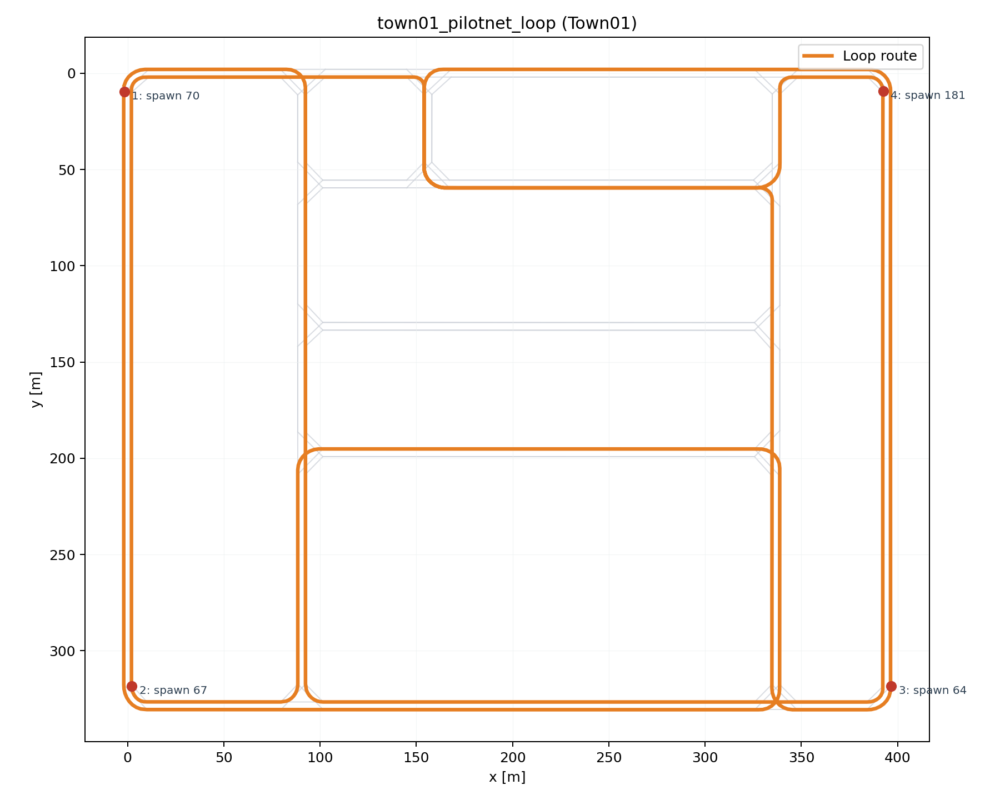

# Town01 PilotNet Route

`Town01` で最初の `PilotNet風 + steer-only + PID longitudinal` を練習するための基準 route。

## 方針

- まずは `Town01` の外周に近い大きめの loop を 1 周完走できることを目標にする
- 交差点の自由意思決定はまだ入れず、route は固定する
- まずは clockwise で回し、学習データの steering 符号バランスを取るために後で counter-clockwise も追加する
- mainline の入力は `front RGB + speed`、必要なら `+ command` までに制限する
- planner 由来の連続 guidance 入力、たとえば `target-point` は mainline では使わない

この document はあくまで **baseline loop** の定義です。Town01 の main goal 自体は、現在は fixed loop 完走ではなく [TOWN01_INTERSECTION_GOAL.md](./TOWN01_INTERSECTION_GOAL.md) の「任意交差点で valid movement を通す」に移っています。

## Success Criteria

最初のベースライン成功条件は「fixed-loop route を planner 付き closed-loop で 1 周完走し、その expert 走行を学習データとして再現対象にできること」。

- map: `Town01`
- route: `data_collection/configs/routes/town01_pilotnet_loop.json`
- lateral model target: `front RGB + speed -> steer`
- longitudinal control: planner / PID 側が担当
- weather: `ClearNoon`
- traffic: なし

`success` は次をすべて満たしたとき:

- `route_completion_ratio >= 0.99`
- `collision_count == 0`
- `max_stationary_seconds < 10`
- `distance_to_goal_m <= 10`
- `manual_interventions == 0`

補助メトリクス:

- `lane_invasion_count`
- `lap_time_seconds`
- `average_speed_kmh`
- `road_option_counts`

この段階では lane invasion を失敗条件にはしない。まずは「ループを止まらずに 1 周できる expert run を作る」ことを優先する。

重要:

- この verified baseline はまだ camera-to-steer の learned E2E policy ではない
- `steer/throttle/brake` は `BasicAgent.run_step()` が返す expert control
- front camera は後段の `PilotNet風 + steer-only` 学習用に観測と教師信号をそろえている段階
- mainline で許可する learned policy 入力は `front RGB + speed (+ optional command)` のみ

検証済みの baseline 実行条件:

- `target_speed_kmh = 30`
- `image_width = 320`
- `image_height = 180`
- `max_seconds = 600`

2026-03-21 の確認では、この設定で `508.75 s`、`collision_count = 0`、`route_completion_ratio = 1.0` で 1 周完走した。

## Route File

- `data_collection/configs/routes/town01_pilotnet_loop.json`

## Plot

- `docs/assets/town01_pilotnet_loop.png`
- `docs/assets/town01_pilotnet_loop_summary.json`



## Route Summary

- ループ種別: clockwise perimeter loop
- 総延長: 約 `4213.08 m`
- planner waypoint 数: `2134`
- anchor 数: `4`
- 主に外周を回るが、junction では planner 上 `LEFT`, `RIGHT`, `STRAIGHT` が混ざる

anchor:

1. spawn `70` at `(-1.76, 9.56)`, yaw `90.0`
2. spawn `67` at `(2.05, 318.38)`, yaw `-90.0`
3. spawn `64` at `(396.64, 318.38)`, yaw `-90.0`
4. spawn `181` at `(392.47, 9.19)`, yaw `90.0`

segment:

1. `70 -> 67`: `1244.02 m`
2. `67 -> 64`: `1028.83 m`
3. `64 -> 181`: `898.97 m`
4. `181 -> 70`: `1032.17 m`

road option counts:

- `LANEFOLLOW`: `1891`
- `LEFT`: `90`
- `RIGHT`: `48`
- `STRAIGHT`: `105`

## 使い方

fixed-loop expert 収集:

```bash
cd /media/masa/ssd_data/carla_alpamayo
./data_collection/scripts/run_collect_town01.sh
```

custom route を使う場合は `./data_collection/scripts/run_collect_town01.sh --route-config path/to/route.json` を使います。

出力:

- frame manifest: `data/manifests/episodes/<episode_id>.jsonl`
- front RGB: `outputs/collect/<episode_id>/front_rgb/*.png`
- summary: `outputs/collect/<episode_id>/summary.json`
- video: `outputs/collect/<episode_id>/front_rgb.mp4`

## メモ

- この route は `Town01` の四隅に近い spawn point を anchor にしている
- 実際の経路は `GlobalRoutePlanner` で anchor 間を接続している
- 学習データ収集の baseline は、この loop route を expert collector で繰り返し回すことに置いている
