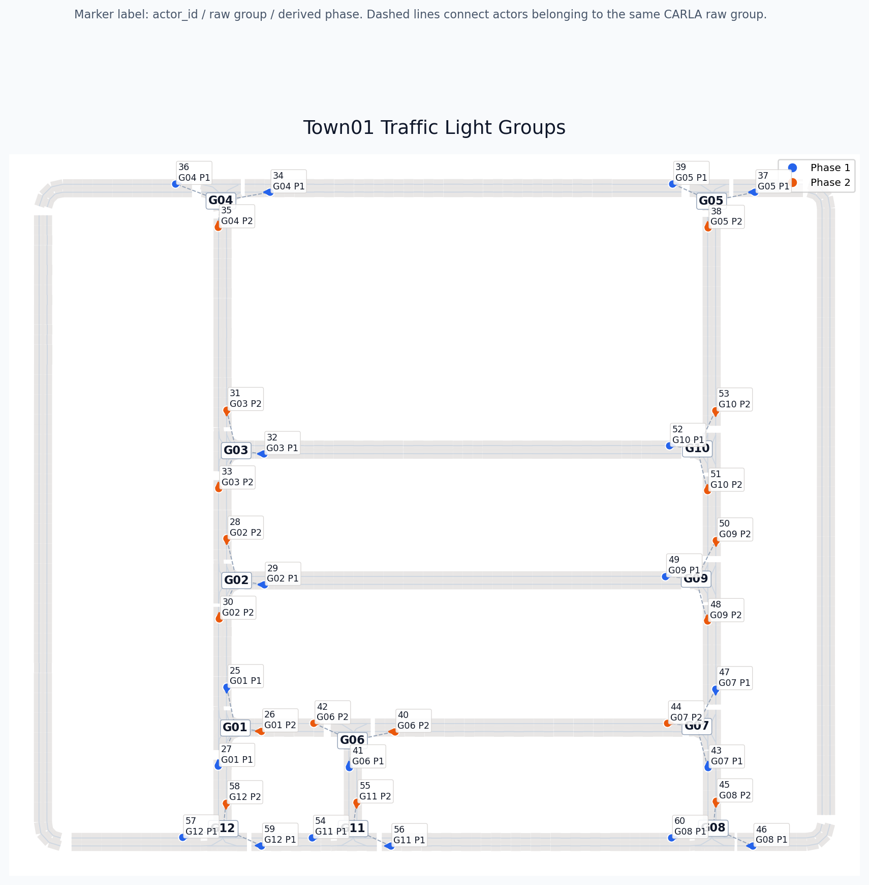
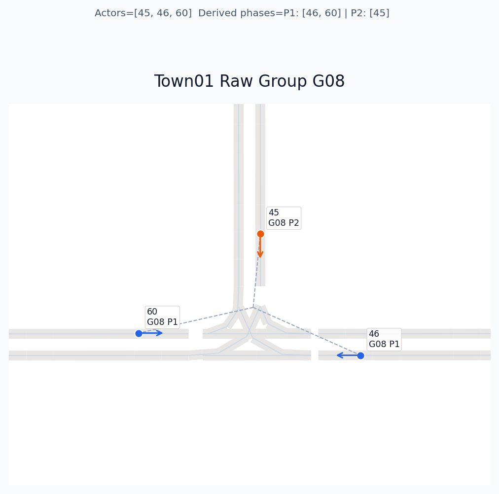

# Simulation Notes

## Traffic Light Rules

Town01 の信号制御は、CARLA が持っている `raw group` をそのまま phase と見なすと現実の交差点制御とずれます。



上の図の見方:

- `G01` 〜 `G12`
  - CARLA の `get_group_traffic_lights()` が返す raw group
- `Phase 1` / `Phase 2`
  - trigger waypoint の向きから、対向方向を同一 phase にまとめた派生 phase
- 点線
  - 同じ raw group に属する actor 同士のつながり
- ラベル
  - `actor_id / raw group / derived phase`

Town01 では、raw group は 3 actor の組になっていることが多いです。
ただし、これは「3 phase 交差点」という意味ではありません。

現在の整理ルール:

- raw group の actor 数を、そのまま phase 数とは見なさない
- 対向方向の actor は同じ phase にまとめる
- 直交する方向、または支線側の進入は別 phase に分ける
- その結果、Town01 の signal group は現在すべて `2 phase` に落ちる

代表例として、Town01 の T 字交差点に対応する raw group 08 はこうなります。



- raw group 08: actors `[45, 46, 60]`
- derived phases: `[[46, 60], [45]]`

つまり、この交差点では

- `46` と `60` を同時 green にする主道路 phase
- `45` を green にする支道路 phase

として扱うのが自然、という判断です。

このルールは、CARLA の built-in group cycle をそのまま使う代わりに、こちらで現実寄りの phase scheduler を作るための前提です。

## How To Regenerate

Town01 の信号 group plot は次で再生成できます。

```bash
cd /home/masa/carla_alpamayo
PYTHONPATH="" uv run python -m simulation.pipelines.plot_traffic_light_groups --town Town01
```

生成先:

- `outputs/inspect/traffic_light_groups/town01/town01_overview.png`
- `outputs/inspect/traffic_light_groups/town01/town01_group_XX.png`
- `outputs/inspect/traffic_light_groups/town01/town01_groups.json`

`simulation/docs/` 配下の画像は README 参照用の固定 snapshot です。
